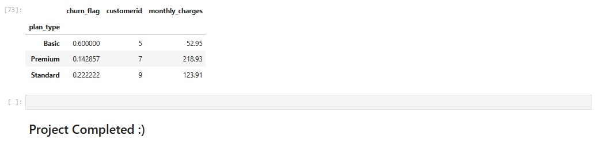

# 📊 Customer Churn Analysis and Customer Intelligence

## 📌 Project Overview

This project analyzes customer churn using Python, SQL, Pandas, NumPy, Matplotlib, Seaborn, and SQLite. The objective is to identify the factors influencing customer churn and generate actionable business insights.

---

## 🛠️ Tools & Technologies

- Python
- SQL (SQLite)
- Pandas
- NumPy
- Matplotlib
- Seaborn
- Jupyter Notebook

---

## 📂 Project Files

- churn_analysis.ipynb
- customer_churn.db
- customer_churn_data_raw.xlsx

---

## 📈 Project Workflow

1. Import Libraries
2. Import Database
3. Data Cleaning
4. Exploratory Data Analysis (EDA)
5. SQL Queries
6. Customer Segmentation
7. Churn Analysis
8. Data Visualization
9. Business Insights
---

---

# 📊 Project Visualizations

## Plan vs Churn Rate

---

## State vs Churn Rate

---

## Correlation Heatmap

---

## Pivot Table

---

## Monthly Churn Trend

---

# ⭐ Key Insights

- Basic plan customers have the highest churn rate.
- Premium plan customers have the lowest churn rate.
- Churn risk has a strong positive correlation with churn score.
- Monthly churn peaked in September.
- Data visualization helps identify customer behavior patterns.

# ⭐ Key Insights

- Basic plan customers have the highest churn rate.
- Premium customers have the lowest churn rate.
- Churn risk is strongly correlated with churn score.
- Monthly churn peaked during September.
- Visualizations help identify customer behavior patterns.

---

## 📊 Key Analysis

- Customer Churn Rate
- Monthly Charges Analysis
- Plan Type Analysis
- Customer Support Analysis
- Subscription Analysis
- Pivot Tables
- SQL Queries
- Data Visualization

---

## 🚀 Skills Demonstrated

- Data Cleaning
- SQL
- Exploratory Data Analysis
- Data Visualization
- Business Intelligence
- Customer Analytics

---

## 👨‍💻 Author

**Aditya Srivastava**

GitHub: https://github.com/adi-7275
